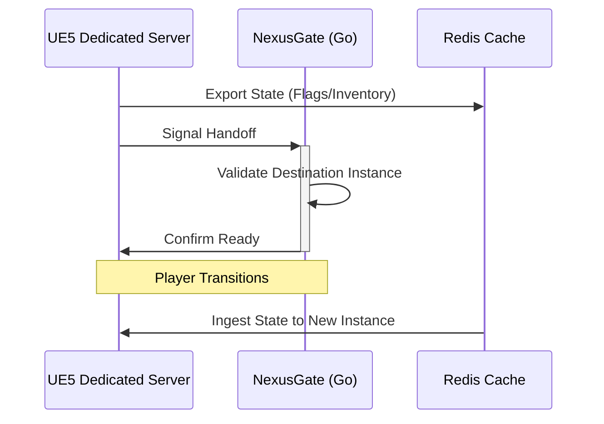

# NexusGate: Cloud-Native UE5 Orchestrator  

## Project Overview  
NexusGate is a Go-based orchestration prototype designed to automate the lifecycle of Unreal Engine 5 (UE5) dedicated servers. The project explores the intersection of high-performance game binaries and container orchestration, focusing on the challenges of state persistence and horizontal scaling in a "Multi-Zonal" game environment.    

## The "Test Bed" Strategy
NexusGate is developed in tandem with Powering Up, a solo two-level UE5 prototype.  

• **The Goal:** Validate cross-server player handoffs.  
• **The Logic:** If a player triggers a "Logic-Gate" in Level 1 (Server A), NexusGate ensures that the "Unlocked" state is persisted and synchronized when the player transitions to Level 2 (Server B).  

## Technical Architecture (Planned & Prototyping)
• **Orchestration:** Utilizing Kubernetes with the Agones framework to manage the unique lifecycle of game server pods (e.g., preventing the shutdown of active player sessions).  
• **Infrastructure as Code (IaC):** Defining reproducible cluster environments using Terraform to ensure environment parity between local development and cloud deployment.  
• **State Persistence:** Integrating Redis as a centralized data layer to handle real-time player progression and logic-gate flags across distributed instances.  
• **CI/CD:** Automated builds via GitHub Actions to package Linux-based UE5 binaries into optimized Docker containers.  

## Logic Gate Handoff and Sequence Diagram

When a player trigger level advancement conditions, UE5 sends a payload to NexusGate, which saves the state in Redis. As the player transitions, NexusGate recalls and applies that state, validating health in the process.    

## Design Objectives & Roadmap
**1. Automated Provisioning:** Reduce the manual overhead of spinning up dedicated server instances based on player demand.  
**2. Health Monitoring:** Implement proactive health checks to ensure "self-healing" capabilities within the cluster.  
**3. Observability:** (Upcoming) Integration of Prometheus/Grafana to track server latency and resource utilization (CPU/Memory).  

## Why this Project Exists
As an aspiring Cloud Services Engineer, I believe that reliability and clarity are the backbones of live-service gaming. NexusGate is my laboratory for applying the "systems-thinking" I developed over a decade in logistics to the complex world of game server infrastructure.

## Tech Stack  
  
| Component | Technology |  
| :--- | :---|  
| **Language** | Go (Backend), C++ (UE5) |  
| **Orchestration** | Kubernetes + Agones |  
| **Infrastructure** | Terraform, Docker |  
| **State/Data** | Redis |
